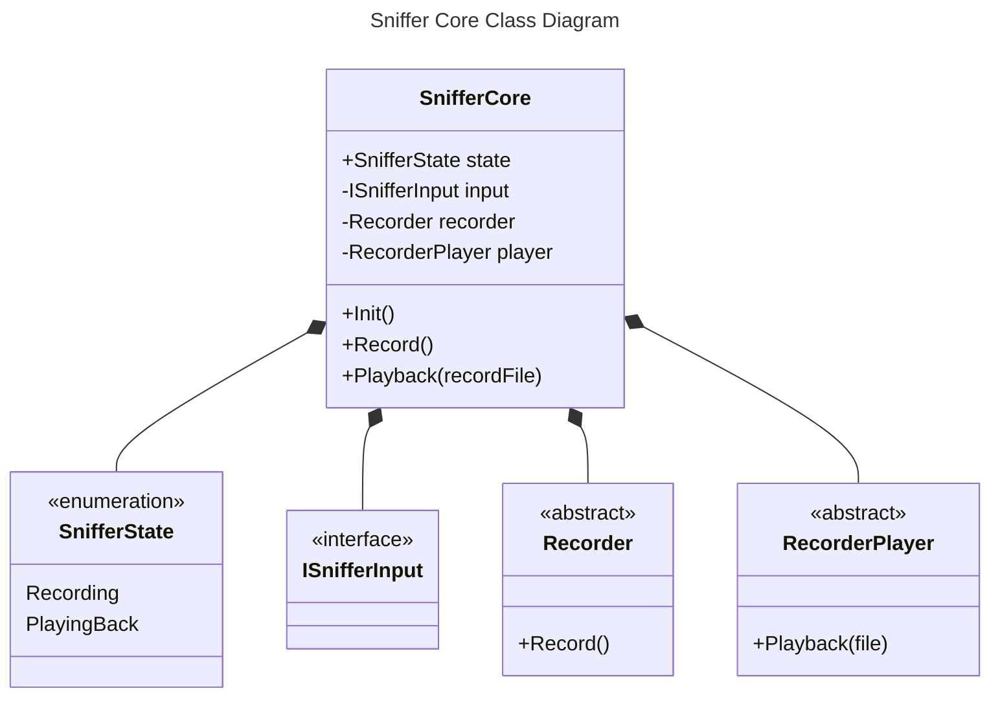
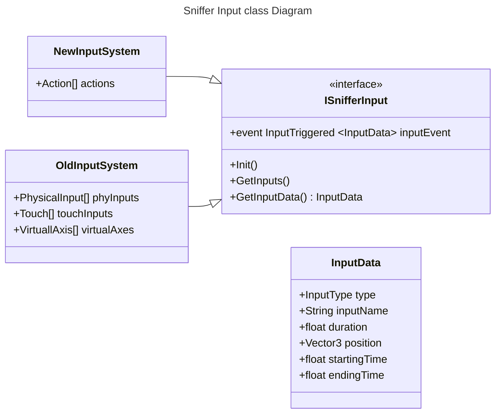
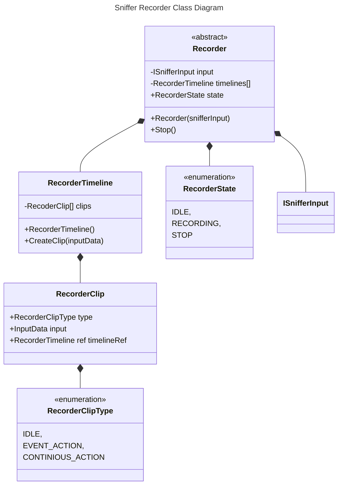

```mermaid
---
title: Sniffer Core Class Diagram
---

classDiagram 
direction TB
class ISnifferInput{
<<interface>>
}
class Recorder{
<<abstract>>
+Record()
}
class RecorderPlayer{
<<abstract>>
+Playback(file)
}
class SnifferCore

SnifferCore: +Init()
SnifferCore: +Record()
SnifferCore: +Playback(recordFile)
SnifferCore: +SnifferState state
SnifferCore: -ISnifferInput input
SnifferCore: -Recorder recorder
SnifferCore: -RecorderPlayer player

class SnifferState{
	<<enumeration>>
	Recording
	PlayingBack
}


SnifferCore *--SnifferState
SnifferCore *--ISnifferInput
SnifferCore *--Recorder
SnifferCore *--RecorderPlayer
```

```mermaid
---
title: Sniffer Input class Diagram
---
classDiagram
direction RL
class ISnifferInput{
<<interface>>
	+event InputTriggered ~InputData~ inputEvent
	+Init()
	+GetInputs()
	+GetInputData() InputData
}

class NewInputSystem{
	+Action[] actions
}

class OldInputSystem{
	+PhysicalInput[] phyInputs
	+Touch[] touchInputs
	+VirtuallAxis[] virtualAxes
}

class InputData{
	+InputType type
	+String inputName
	+float duration
	+Vector3 position
	+float startingTime
	+float endingTime	
}

ISnifferInput <|--NewInputSystem
ISnifferInput <|--OldInputSystem

```

``

```mermaid
---
title: Sniffer Recorder Class Diagram
---
classDiagram
direction TB
class Recorder{
<<abstract>>
	-ISnifferInput input
	-RecorderTimeline timelines[]
	+RecorderState state
	+Recorder(snifferInput)
	+Stop()
}

class RecorderTimeline{
	-RecoderClip[] clips
	+RecorderTimeline()	
	+CreateClip(inputData) 
}

class RecorderClip{
	+RecorderClipType type
	+InputData input
	+RecorderTimeline ref timelineRef
}

class RecorderClipType{
<<enumeration>>
	IDLE,
	EVENT_ACTION,
	CONTINIOUS_ACTION	
 }

class RecorderState{
<<enumeration>>
	IDLE,
	RECORDING,
	STOP
}

RecorderTimeline*--RecorderClip
RecorderClip*--RecorderClipType
Recorder*--RecorderTimeline
Recorder*--RecorderState
Recorder*--ISnifferInput

```

