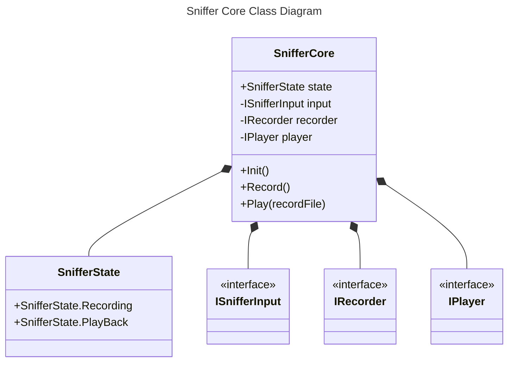
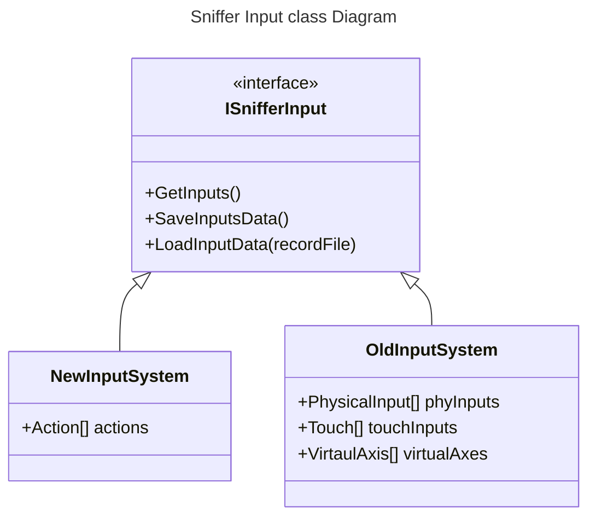

```mermaid
---
title: Sniffer Core Class Diagram
---

classDiagram 
direction TB
class ISnifferInput{
<<interface>>
}
class IRecorder{
<<interface>>
}
class IPlayer{
<<interface>>
}
class SnifferCore

SnifferCore: +Init()
SnifferCore: +Record()
SnifferCore: +Play(recordFile)
SnifferCore: +SnifferState state
SnifferCore: -ISnifferInput input
SnifferCore: -IRecorder recorder
SnifferCore: -IPlayer player

class SnifferState{
	+SnifferState.Recording
	+SnifferState.PlayBack
}


SnifferCore *--SnifferState
SnifferCore *--ISnifferInput
SnifferCore *--IRecorder
SnifferCore *--IPlayer
```

```mermaid
---
title: Sniffer Input class Diagram
---
classDiagram
class ISnifferInput{
<<interface>>
	+GetInputs()
	+SaveInputsData()
	+LoadInputData(recordFile)
}

class NewInputSystem{
	+Action[] actions
}

class OldInputSystem{
	+PhysicalInput[] phyInputs
	+Touch[] touchInputs
	+VirtaulAxis[] virtualAxes
}

ISnifferInput <|--NewInputSystem
ISnifferInput <|--OldInputSystem

```