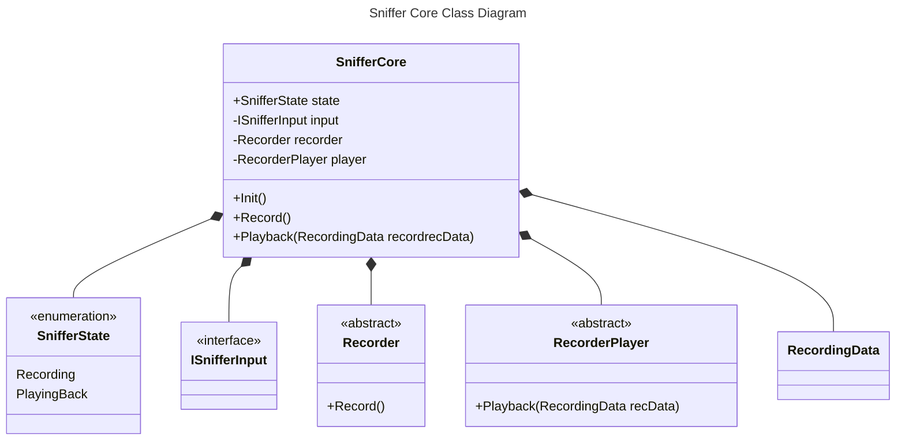
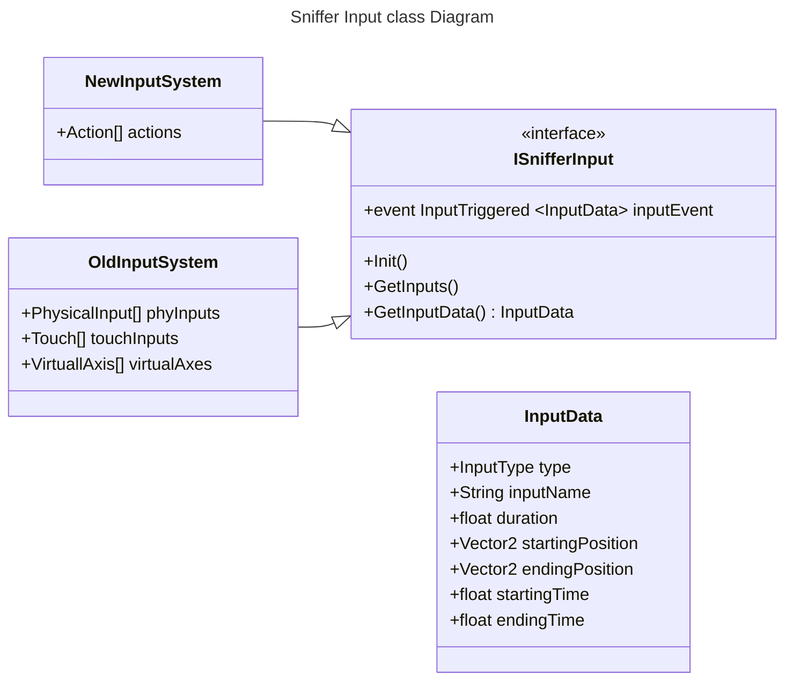
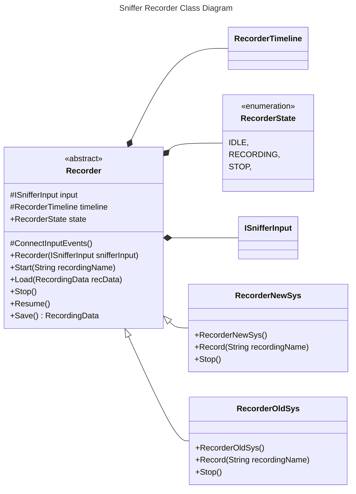
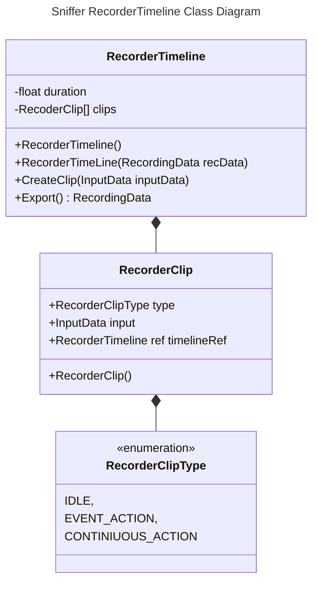
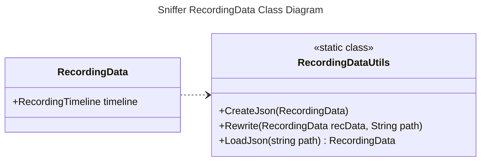

```mermaid
---
title: Sniffer Core Class Diagram
---

classDiagram 
direction TB
class ISnifferInput{
<<interface>>
}
class Recorder{
<<abstract>>
+Record()
}
class RecorderPlayer{
<<abstract>>
+Playback(RecordingData recData)
}
class SnifferCore

SnifferCore: +Init()
SnifferCore: +Record()
SnifferCore: +Playback(RecordingData recordrecData)
SnifferCore: +SnifferState state
SnifferCore: -ISnifferInput input
SnifferCore: -Recorder recorder
SnifferCore: -RecorderPlayer player

class SnifferState{
	<<enumeration>>
	Recording
	PlayingBack
}

class RecordingData{
	
}


SnifferCore *--SnifferState
SnifferCore *--ISnifferInput
SnifferCore *--Recorder
SnifferCore *--RecorderPlayer
SnifferCore*--RecordingData
```

```mermaid
---
title: Sniffer Input class Diagram
---
classDiagram
direction RL
class ISnifferInput{
<<interface>>
	+event InputTriggered ~InputData~ inputEvent
	+Init()
	+GetInputs()
	+GetInputData() InputData
}

class NewInputSystem{
	+Action[] actions
}

class OldInputSystem{
	+PhysicalInput[] phyInputs
	+Touch[] touchInputs
	+VirtuallAxis[] virtualAxes
}

class InputData{
	+InputType type
	+String inputName
	+float duration
	+Vector2 startingPosition
	+Vector2 endingPosition
	+float startingTime
	+float endingTime	
}

ISnifferInput <|--NewInputSystem
ISnifferInput <|--OldInputSystem

```

``

```mermaid
---
title: Sniffer Recorder Class Diagram
---
classDiagram
direction LR
class Recorder{
<<abstract>>
	#ISnifferInput input
	#RecorderTimeline timeline
	#ConnectInputEvents()
	 
	+RecorderState state
	+Recorder(ISnifferInput snifferInput)
	+Start(String recordingName)	
	+Load(RecordingData recData) 
	+Stop()
	+Resume()
	+Save() RecordingData
}

class RecorderState{
<<enumeration>>
	IDLE,
	RECORDING,
	STOP,
}

class RecorderNewSys{
	+RecorderNewSys()
	+Record(String recordingName)
	+Stop() 
}

class RecorderOldSys{
	+RecorderOldSys()
	+Record(String recordingName)
	+Stop()
}

Recorder*--RecorderTimeline
Recorder*--RecorderState
Recorder*--ISnifferInput
Recorder<|--RecorderNewSys
Recorder<|--RecorderOldSys

```

```mermaid
---
title: Sniffer RecorderTimeline Class Diagram
---
classDiagram
direction TB
class RecorderTimeline{
	-float duration
	-RecoderClip[] clips
	+RecorderTimeline()	
	+RecorderTimeLine(RecordingData recData)
	+CreateClip(InputData inputData) 
	+Export() RecordingData 
}

class RecorderClip{
	+RecorderClip()
	+RecorderClipType type
	+InputData input
	+RecorderTimeline ref timelineRef
}

class RecorderClipType{
<<enumeration>>
	IDLE,
	EVENT_ACTION,
	CONTINIUOUS_ACTION	
 }

RecorderTimeline*--RecorderClip
RecorderClip*--RecorderClipType
```

```mermaid
---
title: Sniffer RecordingData Class Diagram
---

classDiagram
direction LR
class RecordingData{
	+RecordingTimeline timeline
}

class RecordingDataUtils{
	<<static class>>	
	+CreateJson(RecordingData)
	+Rewrite(RecordingData recData, String path) 
	+LoadJson(string path) RecordingData
}

RecordingData..>RecordingDataUtils

```
