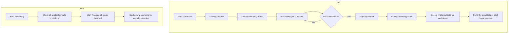

```mermaid
flowchart TD
step1[Start Recording]
step2[Check all available inputs in platform]
step3[Start Tracking all inputs detected]
step4[Start a new courutine for each input action]
step40[Input Coroutine]
step41[Start input timer]
step42[Get input starting frame]
step5[Wait until input is release]
step6{Input was release}
step61[Stop input timer]
step62[Get input ending frame]
step7[Collect final inputData for each input]
step8[Send the inputData of each input by event]

subgraph two
step40-->step41-->step42-->step5-->step6-->|No|step5
step6-->|yes|step61-->step62-->step7-->step8
end

subgraph one
step1-->step2-->step3-->step4
end


```