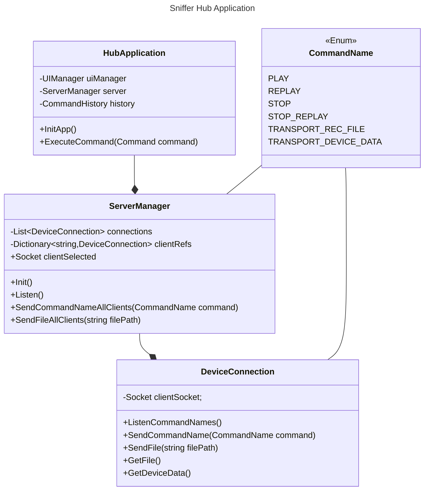
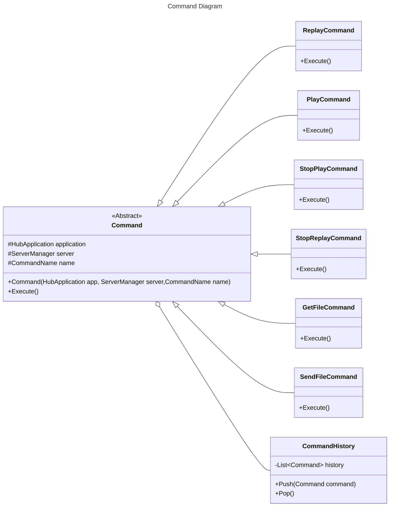
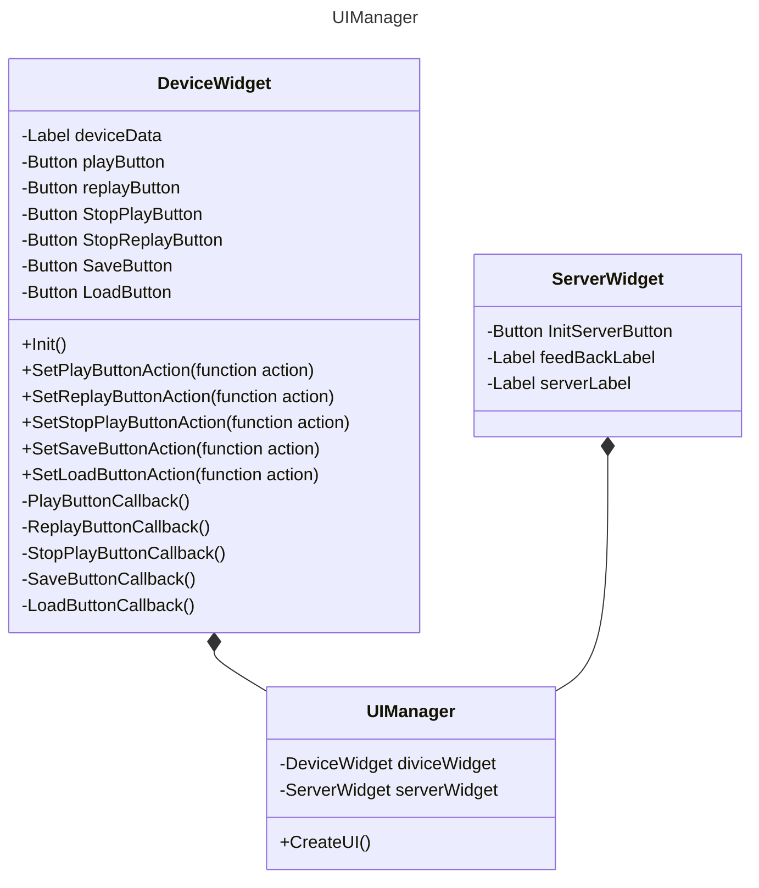

```mermaid 
---
title: Sniffer Hub Application
---
classDiagram
direction BT
class HubApplication {
	-UIManager uiManager
	-ServerManager server
	-CommandHistory history
	 
	+InitApp()
	+ExecuteCommand(Command command) 
}

class CommandName{
<<Enum>>
	PLAY
	REPLAY
	STOP
	STOP_REPLAY
	TRANSPORT_REC_FILE
	TRANSPORT_DEVICE_DATA	
}

class ServerManager{
	-List~DeviceConnection~ connections
	-Dictionary~string,DeviceConnection~ clientRefs
	+Socket clientSelected
 
	+Init()
	+Listen()
	+SendCommandNameAllClients(CommandName command)
	+SendFileAllClients(string filePath) 
} 

class DeviceConnection{
	-Socket clientSocket;
	
	+ListenCommandNames()
	+SendCommandName(CommandName command)
	+SendFile(string filePath) 
	+GetFile()
	+GetDeviceData()
}

ServerManager*--HubApplication
DeviceConnection*--ServerManager
DeviceConnection--CommandName
ServerManager--CommandName
```

```mermaid
---
title: Command Diagram
---
classDiagram
direction LR
class Command{
<<Abstract>>
	#HubApplication application
	#ServerManager server 
	#CommandName name
	+Command(HubApplication app, ServerManager server,CommandName name)	 
	+Execute()
}


class ReplayCommand{
	+Execute()
}

class PlayCommand{
	+Execute()
}

class StopPlayCommand{
	+Execute()
}

class StopReplayCommand{
	+Execute()
}

class GetFileCommand{
	+Execute()
}

class SendFileCommand{
	+Execute()
}

class CommandHistory{
	-List~Command~ history
	 +Push(Command command)
	 +Pop()
}

Command <|--ReplayCommand
Command <|--PlayCommand
Command <|--StopPlayCommand
Command <|--StopReplayCommand
Command <|--GetFileCommand
Command <|--SendFileCommand
Command o--CommandHistory

```

```mermaid
---
title: UIManager
---
classDiagram
direction TB

class UIManager {
	-DeviceWidget diviceWidget
	-ServerWidget serverWidget

	+CreateUI()
}

class DeviceWidget{
	 -Label deviceData
	 -Button playButton
	 -Button replayButton	
	 -Button StopPlayButton
	 -Button StopReplayButton
	 -Button SaveButton
	 -Button LoadButton

	 +Init()

	 +SetPlayButtonAction(function action)
	 +SetReplayButtonAction(function action)
	 +SetStopPlayButtonAction(function action)
	 +SetSaveButtonAction(function action)
	 +SetLoadButtonAction(function action)

	 -PlayButtonCallback()
	 -ReplayButtonCallback()
	 -StopPlayButtonCallback()
	 -SaveButtonCallback()
	 -LoadButtonCallback()
}

class ServerWidget{
	-Button InitServerButton
	-Label feedBackLabel
	-Label serverLabel
}


DeviceWidget*--UIManager
ServerWidget*--UIManager
```